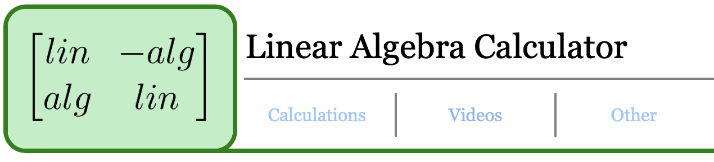

# Linear Algebra Calculator

### A free, educational calculator that performs basic matrix operations and provides helpful visuals!

## Access and use

To access the online linear algebra calculator, follow the link in the description of this repository! 

Once you get to the home page, hover over any of the dropdowns in the navigation bar or in the center of the page to find what you need.

If you want to return to the home page after performing a calculation or being on the *Videos* page, simply click the logo in the top left corner. 

## Inspiration

I decided to make this website shortly after taking my first linear algebra class at UNC Chapel Hill. I noticed that the majority of mathematics involving matrices could be simplified into a relatively simple set of steps, or algorithm. The way I went about solving the problems reminded me of the way computers follow a loop or function to produce an output. During the class, I began working on a calculator that produced the QR factorization of a matrix in Java. Not only did this make the process easier for me on homework, but creating it helped me really understand and remember the steps to take when computing a QR factorization. 

Additionally, I noticed that there were very few visual aids incorporated in class and that they were difficult to find online. This motivated me to include animated videos using the Manim Python library which help visualize concepts in Linear Algebra.

## Future Development

Currently, the website is missing many pages in the *Properties* and *Factorizations* sections, as well as the Vector Projection page in the *Operations* section. These pages will be created and implemented shortly. The Determinant page displays correctly, but its functionality is still in progress right now.

There also only videos included for matrix addition and subtraction at the moment. I intend to include videos on each page, as long as a visualization would be appropriate for the page's purpose. There is also no *Videos, About,* or *Contact Me* page. I am still learning CSS and wish to implement the JavaScript and HTML functionality of the calculation pages before formatting more. The Videos, as they are added, can be accessed on their respective pages. 

At some point, I hope to add information about the complexity of certain calculations (i.e. how many steps it takes to compute a vector projection) and tips to reduce the complexity (i.e. by computing the QR factorization beforehand).